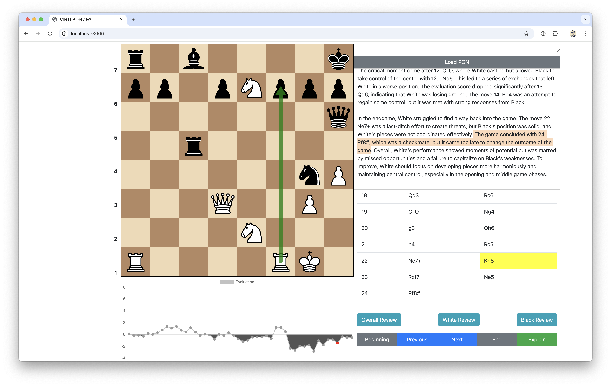
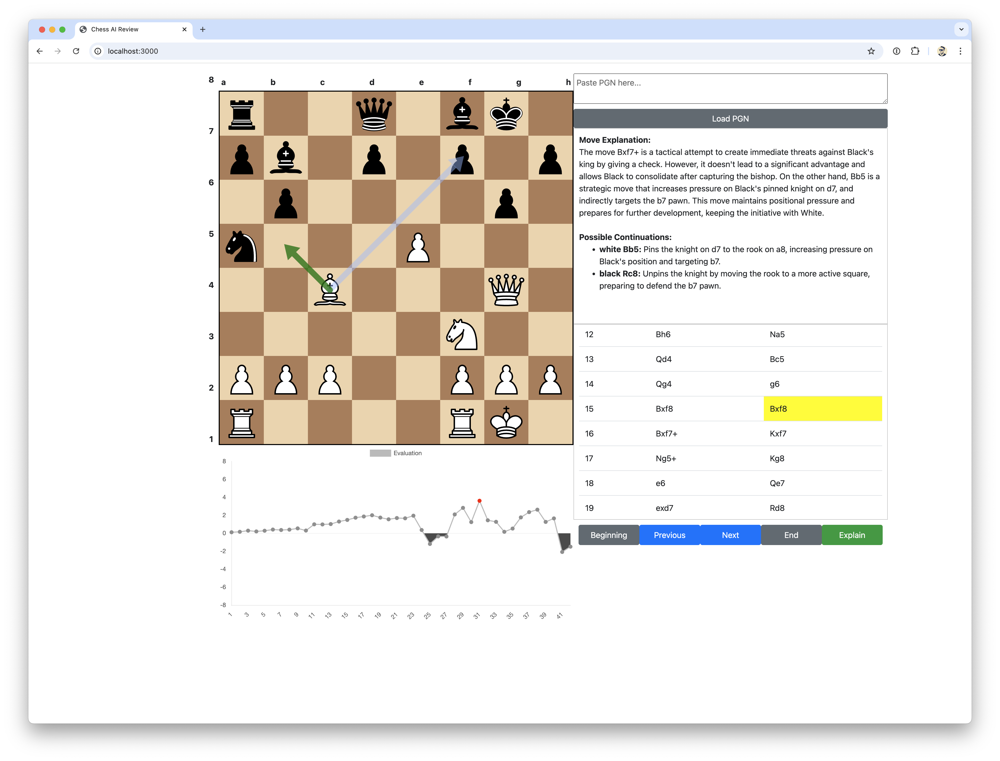
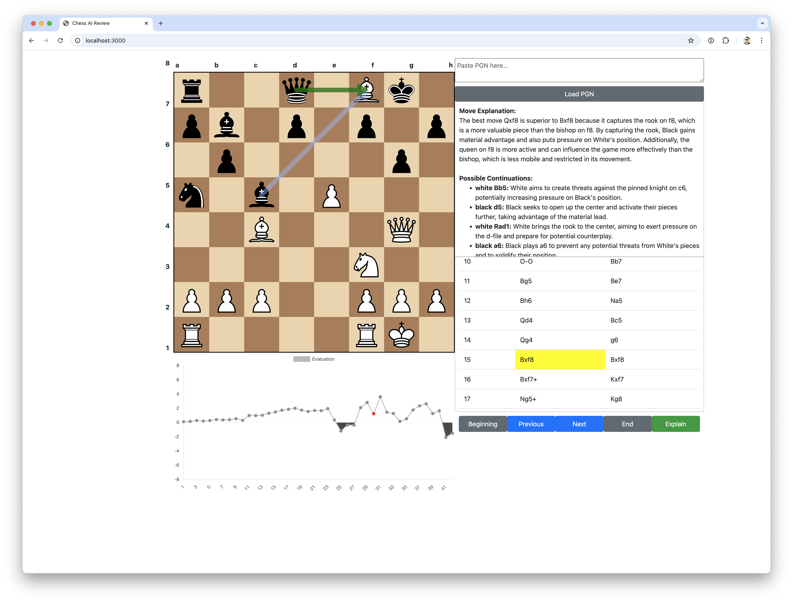

# ThinkFish 🐟🤔

An experimental project combining [Stockfish's](https://stockfishchess.org) calculation 
power with LLM-generated explanations to understand chess moves. Built in one day 
with significant help from [ChatGPT](https://chatgpt.com).


## 💭 Why ThinkFish?
The name pays tribute to Stockfish while highlighting the goal: adding a 
"thinking" layer that explains the **why** behind the proposed chess moves. 
(Both the name and logo were created with ChatGPT)

## ⚡ What This Project Does
✅ Integrates Stockfish for move analysis (real-time evaluation)  
✅ Converts move notation (UCI ↔ PGN) for clarity  
✅ Uses an LLM to attempt human-like move explanations  
✅ Processes position evaluations for better insights  
✅ Provides overall, white, and black game reviews to summarize 
key moments and performance (updated 2024-02-16)

## 🚧 Key Findings & Limitations
This prototype revealed interesting challenges in using LLMs for chess analysis. 
However, a **recent tweak** significantly improved results:
- **Before/After FEN improves accuracy**. Providing FEN state before and after 
  each move helps LLM better understand the board changes, leading to fewer 
  hallucinations
- **Hallucinations still exists but are less severe.** Even with this 
  improvement, LLM can still misinterpret board states, but the errors are now 
  smaller and less game-breaking.
- **GPT-4o sees the biggest improvement.** The updated prompt works best with 
  GPT-4o, while GPT-4o-mini still struggles despite the change
- **This remains an AI limitation.** While the results are better, LLMs can 
  still make mistakes making them not very reliable for precise chess 
  explanations

## 📈 Main Improvement: Before/After FEN (2024-02-16)
The biggest improvement came from **modifying the prompt to include board state 
before and after each move using FEN notation.** This additional context helped 
reduce hallucinations and improved explanation accuracy, especially for 
**GPT-4o**. However models like **GPT-4o-mini** still struggled with consistency

Additionally, a new **game review feature** has been introduced, summarizing 
performance from three perspective:
- Overall game review: general analysis of game's key moements
- White's game review: focuses on white's performance, strengths and missed opportunities
- Black's game review: focuses on black's performance, strengths and missed opportunities

## 📷 Model Performance Comparison

### GPT-4o (Updated prompt)
<details>
<summary>Details for White Review</summary>


This provide pretty solid review. No issue so far
</details>

<details>
<summary>Details</summary>


Provides pretty solid explanation why Stockfish recommended black to g6 but 
it fails to explain that the importance of that move because without moving g6 
white ended up winning the game through backrank check


Solid explanation on the moves however there is a hallucination spotted. By 
putting white Bb5 move, it essentially restrict black's a5 knight. The 
explanation from LLM was it's pinning knight on c6. There is no knight at c6 
but it should have explain that a5 knight will not be able to move to c6
because of white bishop at b5 

</details>

### GPT-4o-mini (Updated prompt, still hallucinates)
<details>
<summary>Details for White Review</summary>


Also solid review for the white but the highlighted text shows inconsistencies.
White's overall performance at the end game wasn't the best but managed to 
do a checkmate due to Black's blunder but the description from the LLM 
indicated that it's too late for White to change the outcome which does not 
make sense.
</details>

<details>
<summary>Details</summary>


Hallucination spotted
- The wording is confusing, it's black's turn yet it's stating that there was 
  a threat by black queen on h4
- It also failed to mention that playing g6 will prevent the backrank checkmate
</details>

### Older prompt
This applies for the older prompt: while testing **GPT-4o and GPT-4o-mini**, 
both models struggled with **accurate move explanations**, even when using 
**Stockfish’s own continuations** instead of LLM-generated moves.

#### GPT-4o (Better but still flawed), before prompt update
<details>
<summary>Details</summary>


Hallucinations spotted

- From move explanation: claimed rook on f8 but it is actually white bishop
- From move explanation: playing black Bxf8 apparently it leaves black queen d8 
  vulnerable to white's queen on g4 which is incorrect as there is no direct 
  path for white queen to attack black queen and at the same time black queen
  is still protected by rook on a8


Hallucinations spotted

- From move explanation: claimed that by following best move (white Bb5) it can
  pin the knight on d7. There is no knight on d7 and it's currently occupied 
  with black pawn
- From move explanation: it also claimed that it by following the best move 
  white can also put pressure targeting b7 pawn which is also invalid. b7 has 
  black bishop, not pawn
- From continuations: black Rc8 supposedly unpin the knight but there is no 
  knight at that square

</details>

### GPT-4o-mini (More hallucinations, worse accuracy), before prompt update
<details>
<summary>Details</summary>



Hallucinations spotted: 

- From the move explanation: it claimed that there is a rook on f8 which is 
  already wrong since it's a white bishop
- Possible continuations white Bb5 mentioning that pinning the knight on c6 
  which is also incorrect as there is no knight on c6

</details>


## 🏗️ Technical Stack
- Node 23.7.0 and above  
- Stockfish.js  
- chess.js  
- chessboard2.js  

## 🚀 Quick Start
```bash
# Install dependencies
npm install

# Clone the repo
git clone https://github.com/yourgithub/thinkfish.git
cd thinkfish

# Create .env file
touch .env

# Add your OpenAI API key
echo "OPENAI_API_KEY=<your-key>" >> .env

# Run the project
node start
```

Visit http://localhost:3000 to use the web app, and load a PGN file for
testing (e.g., `sample.pgn` and `sample2.pgn` is provided as a reference).

## 🛑 Project Status
This remains a prototype, and while the prompt update significantly improved 
results, LLM-based chess explanations still have fundamental limitations. 
**There are no plans for further development at this time**

## 🤝 Contributing
This remains a **prototype**, and while I won’t be actively maintaining it, 
feel free to explore, modify, or use it as inspiration for your own projects.

## 📜 License
MIT License. Feel free to experiment!

