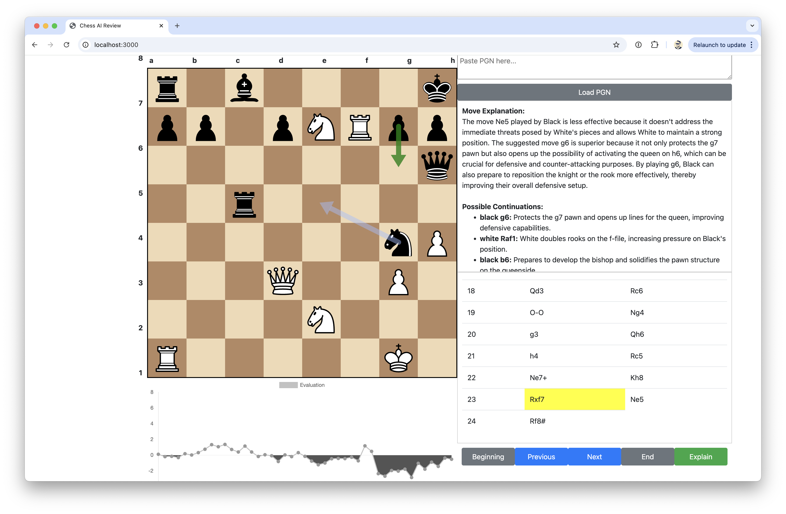
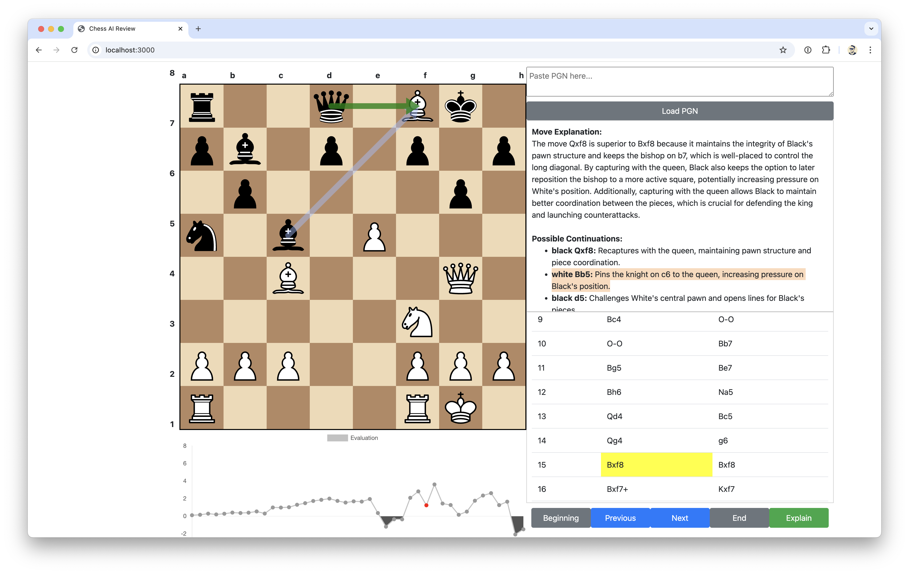
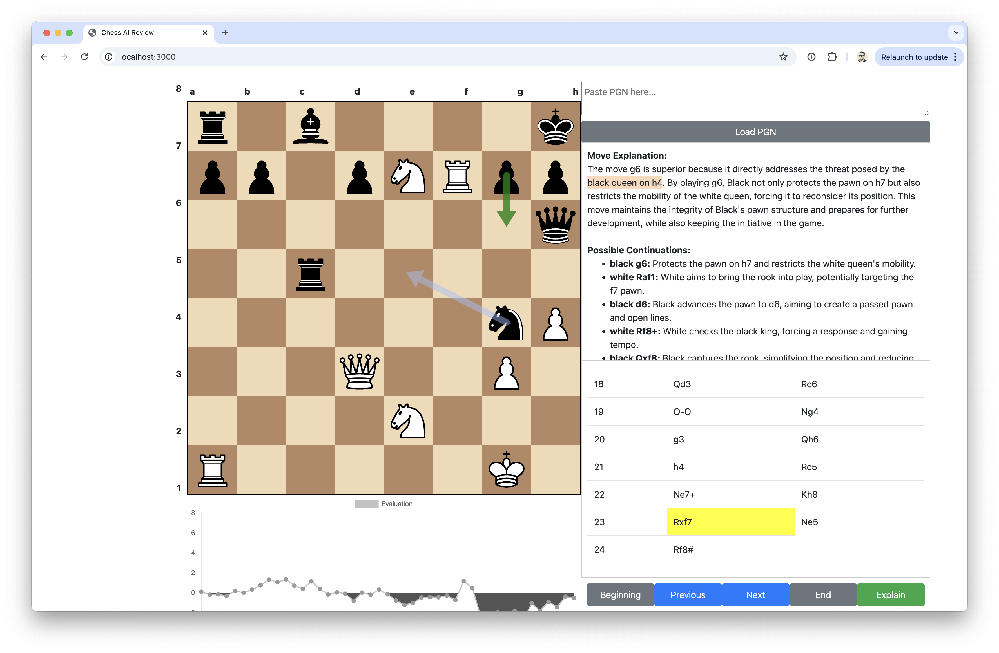

# ThinkFish 🐟🤔

An experimental project combining [Stockfish's](https://stockfishchess.org) calculation 
power with LLM-generated explanations to understand chess moves. Built in one day 
with significant help from [ChatGPT](https://chatgpt.com).


## 💭 Why ThinkFish?
The name pays tribute to Stockfish while highlighting the goal: adding a 
"thinking" layer that explains the **why** behind the proposed chess moves. 
(Both the name and logo were created with ChatGPT)

## ⚡ What This Project Does
✅ Integrates Stockfish for move analysis (real-time evaluation)  
✅ Converts move notation (UCI ↔ PGN) for clarity  
✅ Uses an LLM to attempt human-like move explanations  
✅ Processes position evaluations for better insights  

## 🚧 Key Findings & Limitations
This prototype revealed interesting challenges in using LLMs for chess analysis:

- 🤖 **LLMs often hallucinate explanations**, even with correct move sequences.  
- ⚠️ **Generated continuations frequently include illegal moves, misinterpreting board positions.** Even after abandoning LLM-generated move sequences and using **Stockfish's own continuations**, the LLM still struggled to explain moves correctly without hallucinating.  
- 🧮 **While chess engines excel at calculations, converting their output to human reasoning remains challenging.**  
- 🔍 **Structured rule-based logic is difficult for LLMs**, making them unreliable for precise chess explanations.  
- 📉 **Tried both GPT-4o and GPT-4o-mini** for move explanations—**GPT-4o performed better but still generated a significant number of incorrect explanations.**  

## 📷 Model Performance Comparison
While testing **GPT-4o and GPT-4o-mini**, both models struggled with **accurate 
move explanations**, even when using **Stockfish’s own continuations** instead 
of LLM-generated moves.

### GPT-4o (Better but still flawed)  
<details>
<summary>Details</summary>


Hallucinations spotted

- From move explanation: claimed rook on f8 but it is actually white bishop
- From move explanation: playing black Bxf8 apparently it leaves black queen d8 
  vulnerable to white's queen on g4 which is incorrect as there is no direct 
  path for white queen to attack black queen and at the same time black queen
  is still protected by rook on a8


Hallucinations spotted

- From move explanation: claimed that by following best move (white Bb5) it can
  pin the knight on d7. There is no knight on d7 and it's currently occupied 
  with black pawn
- From move explanation: it also claimed that it by following the best move 
  white can also put pressure targeting b7 pawn which is also invalid. b7 has 
  black bishop, not pawn
- From continuations: black Rc8 supposedly unpin the knight but there is no 
  knight at that square

</details>

### GPT-4o-mini (More hallucinations, worse accuracy)
<details>
<summary>Details</summary>



Hallucinations spotted: 

- From the move explanation: it claimed that there is a rook on f8 which is 
  already wrong since it's a white bishop
- Possible continuations white Bb5 mentioning that pinning the knight on c6 
  which is also incorrect as there is no knight on c6

</details>


## 🏗️ Technical Stack
- Node 23.7.0 and above  
- Stockfish.js  
- chess.js  
- chessboard2.js  

## 🚀 Quick Start
```bash
# Install dependencies
npm install

# Clone the repo
git clone https://github.com/yourgithub/thinkfish.git
cd thinkfish

# Create .env file
touch .env

# Add your OpenAI API key
echo "OPENAI_API_KEY=<your-key>" >> .env

# Run the project
node start
```

Visit http://localhost:3000 to use the web app, and load a PGN file for
testing (e.g., `sample.pgn` is provided as a reference).

## 🛑 Project Status
This was built **as a rapid prototype** in a single day. While the integration 
of **Stockfish + LLM** was successful, the fundamental challenges with LLM-based 
chess explanations make this approach impractical for serious chess analysis. 
**LLMs frequently hallucinate moves, misinterpret board states, and struggle 
with structured logic.** Even when relying on **Stockfish's own continuations 
instead of LLM-generated moves**, explanations were still frequently incorrect

After testing both **GPT-4o and GPT-4o-mini**, it became clear that while 
**GPT-4o performed better, it still produced many invalid explanations**, 
making LLMs unreliable for structured rule-based chess analysis.

As a result, there are **no plans for further development**. However, this 
remains an interesting exploration of AI limitations in structured domains 
like chess.

## 🤝 Contributing
This remains a **prototype**, and while I won’t be actively maintaining it, 
feel free to explore, modify, or use it as inspiration for your own projects.

## 📜 License
MIT License. Feel free to experiment!

